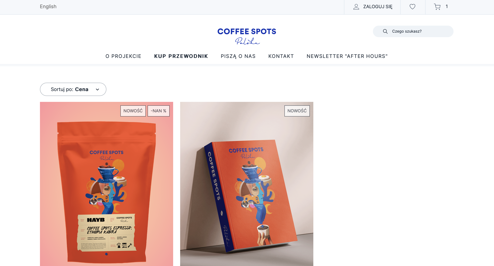

# Discount Calculation Display Error

## Description:

On the website, the discount value is incorrectly displayed as -NAN% rather than showing the expected discount percentage (e.g., -20%). This indicates that a calculation issue is causing the output to render "Not a Number" (NaN) rather than a valid numerical value.

## Preconditions:

The user is not logged in.

## Steps to Reproduce:

1. Run the browser and open https://coffeespots.pl/l.
2. Choose menu item “Kup przewodnik” from the menu.

## Expected Behavior:

Discount value should be displayed correctly, for example “-20%”.

## Actual Behavior:

Discount value is displayed as “-NAN%”.

## Environment:

Browsers: ChromeVersion 130.0.6723.116, Safari Version 18.1

Devices: Desktop

Operating Systems: macOS Sequoia Version 15.1

## Priority and severity

Priority Level: Low

The bug doesn’t prevent users from completing their intended actions (users can still browse, add items to cart, and complete purchases). Addressing it could be left to a later sprint, especially if other functional issues have higher importance.

Severity: Low

Reported bug does not disrupt core functionality. It's primarily a cosmetic issue affecting how information is displayed, rather than a technical error that blocks any workflow.

## Screenshots:

