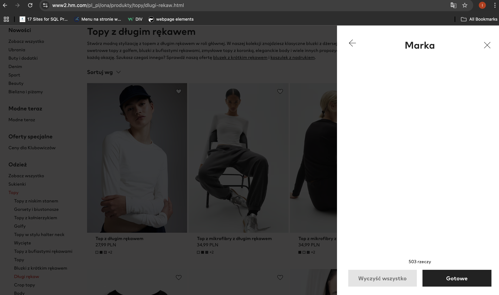

# Non-functioning filters from filter tab

## Description:

After clicking the filter tab “filtruj” on the right side of the page and choosing categories, the user is unable to filter items by concrete categories, such as size, brand, material and quality.

## Steps to Reproduce:

1. Run the browser and open https://www2.hm.com/pl_pl/index.html.

2. Hover over one of the main categories “Ona” in the menu bar.

3. Choose “Topy” from the list.

4. Click the filter tab “filtruj” on the right side of the page.

5. Choose the “size” category. If a filter tab is empty in this category, click the back arrow (as a return) or close button to click the filter tab “filtruj” again and choose another category from the filter tab.

6. Choose other categories (brand, material, and quality left) and do the same with them as in point 5.

## Expected Behavior:

All of the filters from categories in the filter tab are visible. The user can click on them and filter items by concrete categories, such as size, brand, material and quality.

## Actual Behavior:

All of the filters from categories in the filter tab are not visible. The user can't click on them and filter items by concrete categories, such as size, brand, material and quality.

## Environment:

Browsers: Chrome Version 130.0.6723.58, Safari Version 18.0.1 (20619.1.26.31.7)

Devices: Desktop, mobile phone

Operating Systems: macOS Sequoia Version 15.0.1, Iphone 14 Pro iOS 18.0.1

## Priority and severity

Priority Level: High

This issue should be addressed with high priority, as the lack of filtering functionality can make it difficult for users to find desired products, which could result in lost sales. What is more, the problems with filtering can impact user experience. Therefore, this issue should be resolved as soon as possible.

Severity: High

The inability to filter by key product attributes, such as material, size, and quality, directly impacts the functionality of the website. This is a significant issue, as it hinders users from finding suitable products, leading to frustration and potentially causing them to leave the site.

## Screenshots:

