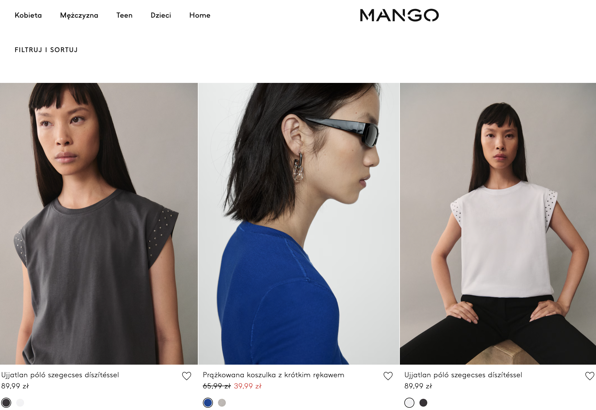
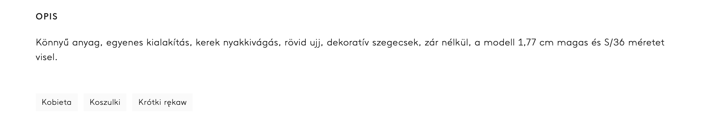
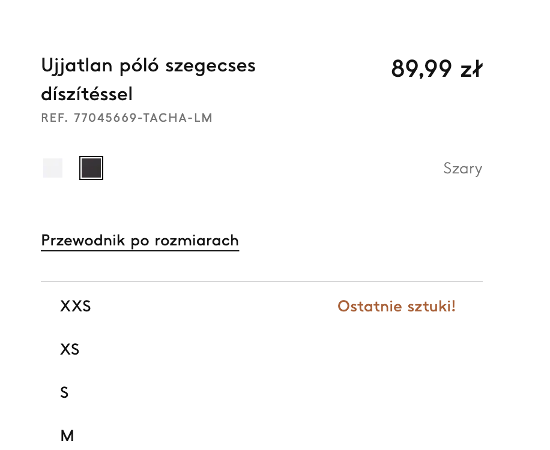
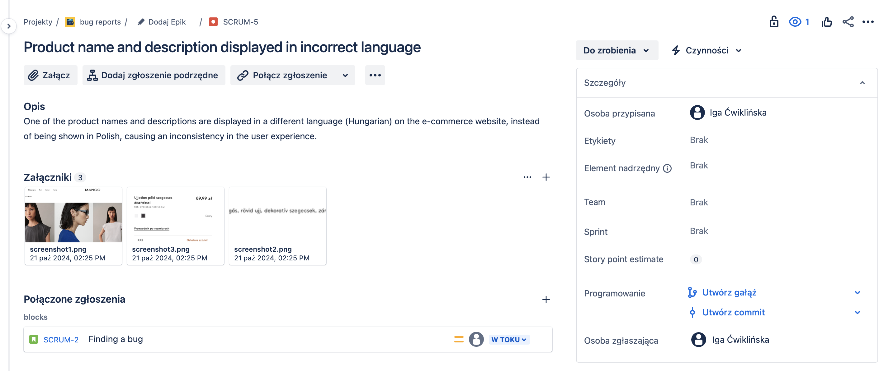

# Product name and description displayed in incorrect language

## Description:
One of the product names and descriptions are displayed in a different language (Hungarian) on the e-commerce website, instead of being shown in Polish, causing an inconsistency in the user experience.

## Steps to Reproduce:

1. Run the browser and open https://shop.mango.com/pl/pl/h/kobieta.
2. Hover over the “Kobieta” section in the menu tab.
3. Select option “Koszulki” from menu.
4. Choose product with the name “Ujjatlan póló szegecses díszítéssel”.

## Expected Behavior:

The name and description of concrete product should be displayed in Polish.

## Actual Behavior:

The name and description of concrete are displayed in Hungarian.

## Environment:

Browsers: Chrome Version 129.0.6668.89

Devices: Desktop

Operating Systems: macOS Sonoma Version 14.6.1

## Priority and severity

### Priority Level: High

Aforementioned defect should be solved quickly, because users expect concrete language and the presence of incorrect language can contribute to their frustration and affect purchase decisions (it can lead to business losses). Additionally, the website is frequently visited, fixing it may have high priority.

### Severity: Low

Despite the described defect the system works correctly as it is expected. The language is not an essential part of the system regarding functionalities, but it looks unprofessional.

## Screenshots:

