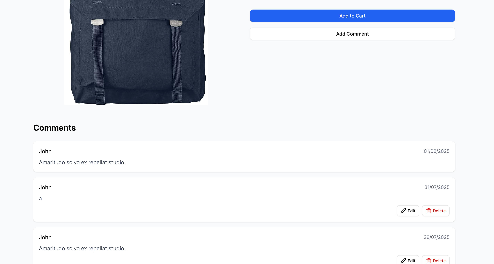

# Newly added comment is missing Edit and Delete buttons

### Bug ID: #128

### Reported By: Iga

### Date Reported: 01.08.2025

### Severity: High

### Priority: High

### Environment:

- Browsers: Chrome Version 138.0.7204.169
- Devices: Desktop
- Operating Systems: macOS Sequoia Version 15.5

## Description:

After successfully submitting a new comment on the product page, the comment is displayed, but Edit and Delete buttons are missing. Older comments (added in previous sessions) correctly display both buttons. This prevents users from modifying or removing their most recent comment.

## Preconditions:

The user should be logged in.

## Steps to Reproduce:

1. Log in as a valid user

2. Navigate to “products” category from navigation menu

3. Choose any product and click “Add comment” button

4. Add a new comment (e.g. "Great product!")

5. Observe the newly added comment on a product page

## Expected Behavior:

The newly added comment should display both Edit and Delete buttons, just like the other existing comments.

## Actual Behavior:

The new comment appears without Edit and Delete buttons. Older comments still have these buttons visible and functional.

## Priority and severity

- Severity: High

Significant functionality is broken — user cannot interact with a key feature

- Priority: High

Core comment functionality is affected — should be fixed before next release

## Screenshots:

