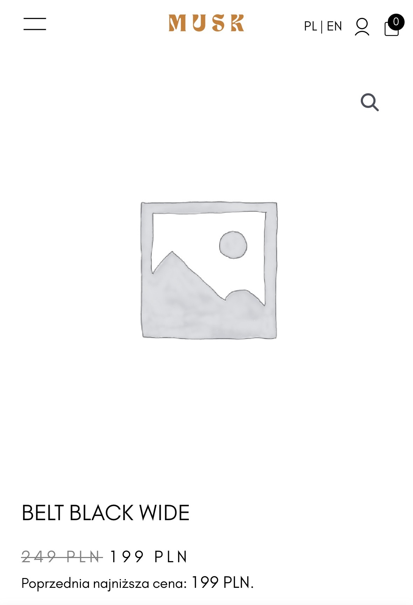

# Product image not displayed on product details page

### Bug ID: #130

### Reported By: Iga

### Date Reported: 04.09.2025

### Severity: High

### Priority: High

### Status: Open

### Environment:

- Browsers: ChromeVersion 133.0.6943.127, Version 18.3 (20620.2.4.11.5)
- Devices: Desktop
- Operating Systems: macOS Sequoia Version 15.3.1

## Description:

When navigating to a product details page, the main product image is not displayed. Instead, a broken image icon appears. This issue occurs in the case of the one concrete product.

## Preconditions:

The user is not logged in.

## Steps to Reproduce:

1. Run the browser and go to https://www.muskboots.com/
2. Select the “shop” category from the hamburger menu
3. When the list of subcategories appear click on “belt” category
4. Choose the product with the name “Belt black wide”

## Expected Result:

The product image should be displayed correctly at the top of the product details page.

## Actual Result:

The main product image is not displayed on the product details page. Users can see only a broken image icon.

## Priority and severity

- Severity: High

The issue prevents users from seeing the product image, which is a critical piece of information for making a purchase decision. While the app is still functional, the missing image significantly impacts usability and user experience.

- Priority: High

Since this directly affects the shopping experience and may reduce conversion rates, it should be fixed as soon as possible.

## Screenshots:

