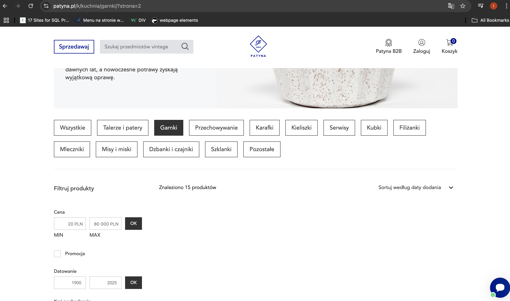

# Products Not Displaying After Selecting a Category from the Menu

### Bug ID: #150

### Reported By: Iga

### Date Reported: 01.12.2025

### Severity: High

### Priority: High

### Status: Open

## Description:

When a user selects one of the categories from the main menu, the product list does not display any items. However, the top section of the page shows a message indicating that "15 products were found". This suggests that the system retrieves the correct number of products, but the product list fails to render on the page.

## Preconditions:

The user doesn't have to be logged in.

## Steps to Reproduce:

1. Open the website https://patyna.pl/.
2. Click on category “Kuchnia” in the main menu.
3. Select “Garnki” from the list.
4. Observe the product listing section.

## Expected Behavior:

All products belonging to the selected category should be displayed in the product list.

## Actual Behavior:

No products are displayed, despite the message indicating that 15 products were found.

## Environment:

- Browsers: ChromeVersion 142.0.7444.176
- Devices: Desktop
- Operating Systems: macOS Tahoe 26.1

## Priority and severity

- Severity: High

The issue prevents users from viewing products, significantly impacting core functionality.

- Priority: High

Should be fixed as soon as possible due to its effect on the shopping experience. It hinders users from buying products.

Screenshots:

Product image not displayed on product details page
 Bug ID: #130
 Reported By: Iga
 Date Reported: 04.09.2025
 Severity: High
 Priority: High
 Status: Open
 Environment:
Browsers: ChromeVersion 133.0.6943.127, Version 18.3 (20620.2.4.11.5)
Devices: Desktop
Operating Systems: macOS Sequoia Version 15.3.1
Description:
When navigating to a product details page, the main product image is not displayed. Instead, a broken image icon appears. This issue occurs in the case of one concrete product.
Preconditions:
The user is not logged in.
Steps to Reproduce:
Run the browser and go to https://www.muskboots.com/
Select the “shop” category from the hamburger menu
When the list of subcategories appear click on “belt” category
Choose the product with the name “Belt black wide”
Expected Result:
The product image should be displayed correctly at the top of the product details page.
Actual Result:
The main product image is not displayed on the product details page. Users can see only a broken image icon. 
Priority and severity
Severity: High  
The issue prevents users from seeing the product image, which is a critical piece of information for making a purchase decision. While the app is still functional, the missing image significantly impacts usability and user experience.
Priority: High 
Since this directly affects the shopping experience and may reduce conversion rates, it should be fixed as soon as possible.
Screenshots:

Title: Product image not displayed on product details page in mobile app
Environment:
App version: 3.2.1

Device: iPhone 13 (iOS 17.3)

Network: Wi-Fi and LTE (same behavior)

Steps to Reproduce:
Open the mobile app.

Navigate to the product catalog.

Select any product and go to its details page.

Expected Result:
The product image should be displayed correctly at the top of the product details page.
Actual Result:
 The product image area remains blank/empty. No image is loaded.
Additional Information:
Issue occurs consistently across multiple products.

Clearing cache and reinstalling the app did not resolve the problem.

Other elements (title, description, price) load correctly.

Screenshots attached.

Severity: Major – The issue prevents users from seeing the product image, which is a critical piece of information for making a purchase decision. While the app is still functional, the missing image significantly impacts usability and user experience.
Priority: High – Since this directly affects the shopping experience and may reduce conversion rates, it should be fixed as soon as possible.

