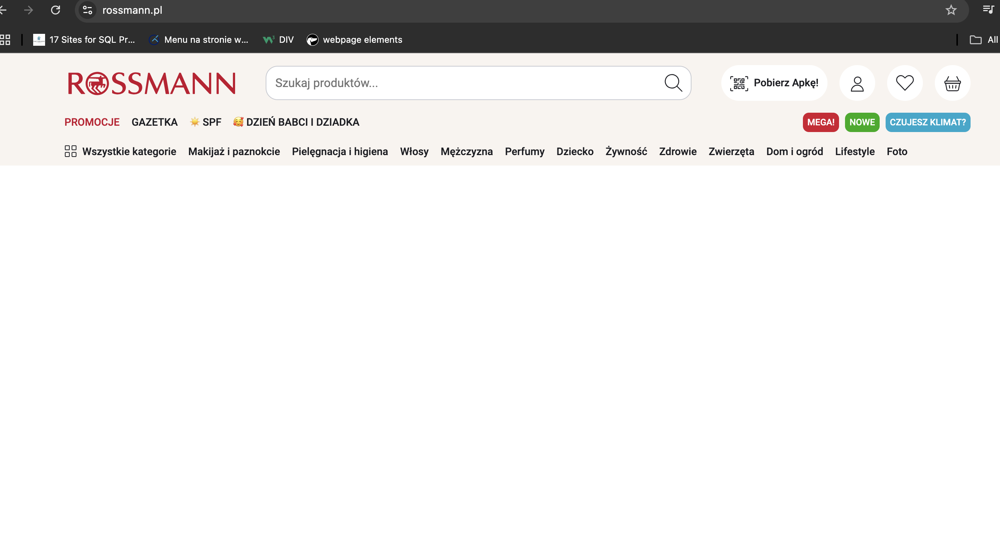

# Non-Functioning Navigation Menu

### Bug ID: #124

### Reported By: Iga

### Date Reported: 28.02.2025

### Severity: High

### Priority: High

### Environment:

- Browsers: ChromeVersion 133.0.6943.127, Version 18.3 (20620.2.4.11.5)
- Devices: Desktop
- Operating Systems: macOS Sequoia Version 15.3.1

## Description:

The navigation menu is non-functional on browsers, all of the categories not responding when clicked. This issue affects the usability of the website, hindering users from essential actions on the website (buying products).

## Preconditions:

The user is not logged in

## Steps to Reproduce:

1. Run the browser and go to https://www.rossmann.pl/

2. Click on each category from the navigation menu (e.g. "Makijaż i paznokcie", "Pielęgnacja i higiena" etc.)

## Expected Result:

Clicking on every category in the navigation menu should navigate the user to the corresponding page with products.

## Actual Result:

All of the categories don’t respond. Below the navigation menu the user can only notice a blank space.

## Priority and severity

Severity: High

This issue directly impacts the core functionality of the website. The navigation menu allows users to access different sections of the website. Non-functioning navigation menu makes users unable to explore the website.

Priority: High

The issue needs immediate attention due to its significant impact on usability. Users may leave the website, leading to loss of engagement, conversions, or revenue.

## Screenshots:

