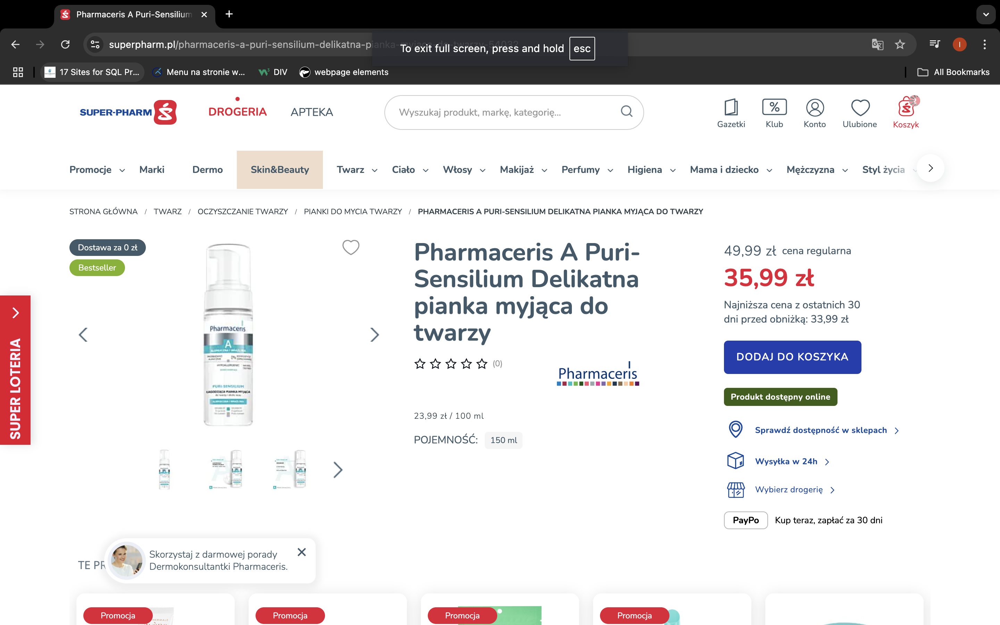
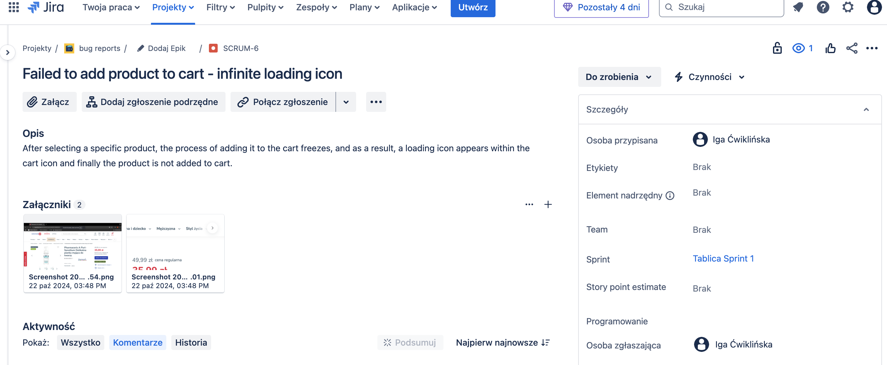

# Failed to add product to cart - infinite loading icon

## Description:

After selecting a specific product, the process of adding it to the cart freezes, and as a result, a loading icon appears within the cart icon and finally the product is not added to cart.

## Preconditions

The user is not logged in.

## Steps to Reproduce:

1. Run the browser and open https://www.superpharm.pl/.
2. Hover over the search field in the menu tab.
3. Type “Pharmaceris A Puri-Sensilium Delikatna pianka myjąca do twarzy” within search field and click enter.
4. Add a product to cart.

## Expected Behavior:

The product should be added to cart and the number on the cart icon should be increased by 1.

## Actual Behavior:

The product is not added to cart and cart icon contains infinite loading icon instead of increased number.

## Environment:

Browsers: Chrome Version 130.0.6723.58, Safari Version 18.0.1 (20619.1.26.31.7)

Devices: Desktop, mobile phone

Operating Systems: macOS Sonoma Version 14.6.1, Iphone 14 Pro iOS 18.0.1

## Priority and severity

Priority Level: High

The bug should be solved swiftly, because users are not enabled to perform crucial functions on the site (adding products to the cart and potentially making a purchase). Fixing this bug should be prioritized to avoid losing customers and transactions.

Severity: High

One of the main functions within the system doesn't work correctly as it is expected. It has a significant impact on customers directly (lack of ability to purchase a product). This can lead to user frustration and revenue loss. Although the user can still browse the site and search for other products, the bug prevents them from completing a key action (purchasing).

## Screenshots:

