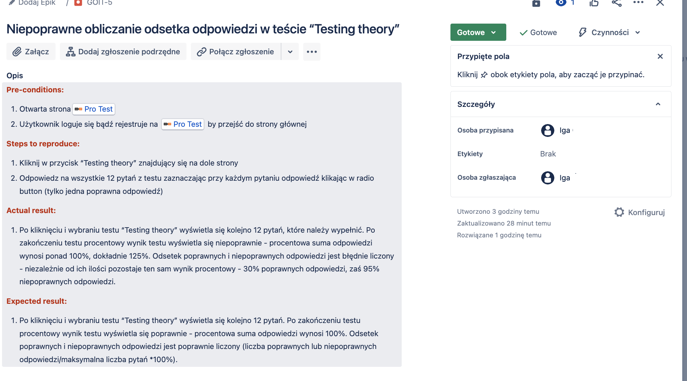
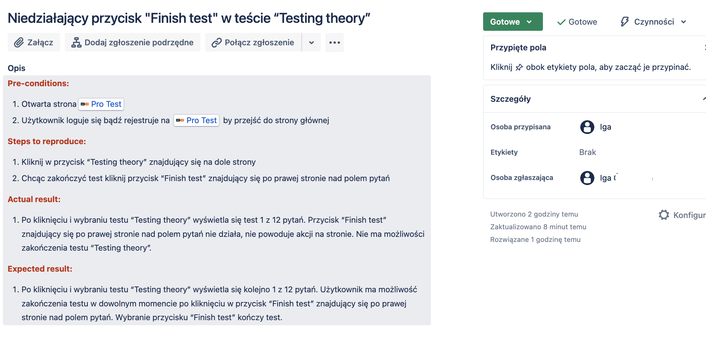
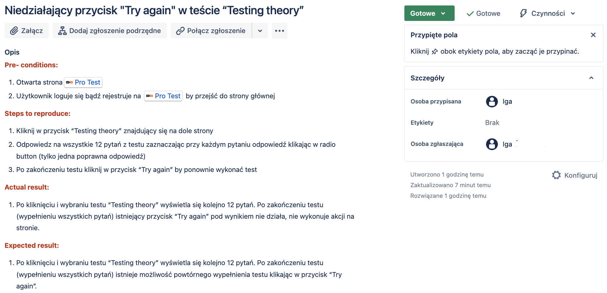
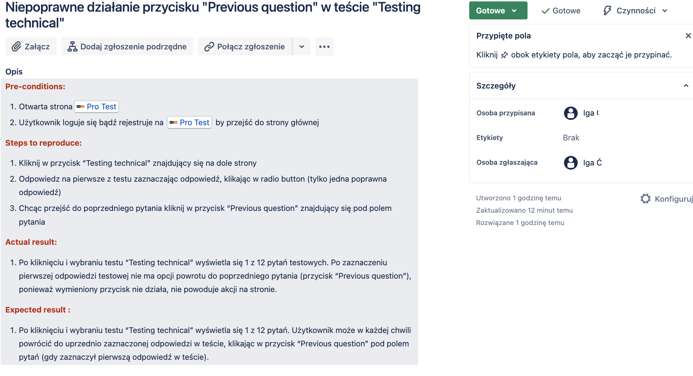
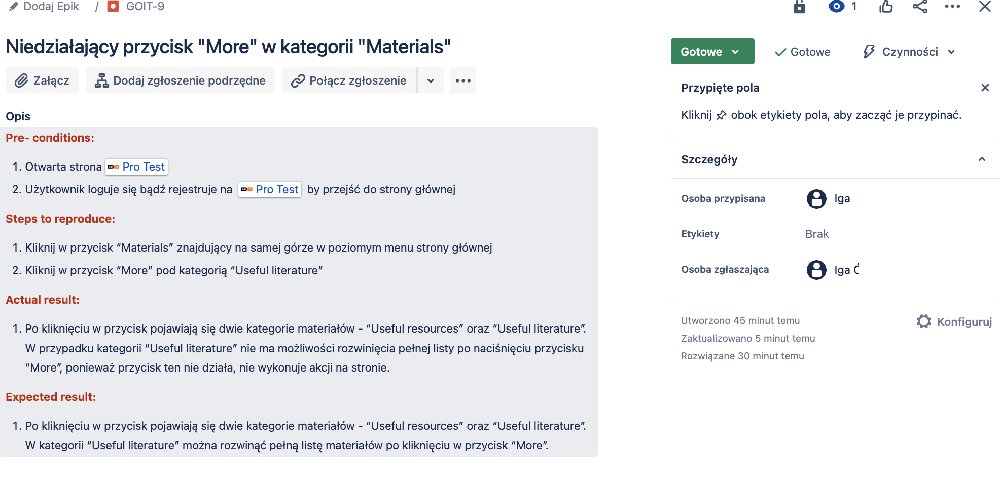

# BUG REPORTS

## **Warning: This bug report was created at the beginning of my journey in learning software testing, so it may contain mistakes that I am learning from.**

## Description

Bug reports offer detailed information about issues encountered on the website, such as non-functional buttons and features (in this case - incorrect calculation of the percentage of responses). Each report is structured with essential elements: preconditions, steps to reproduce, actual results and expected results.

## Here are the screenshots from the bug reports shown below:

